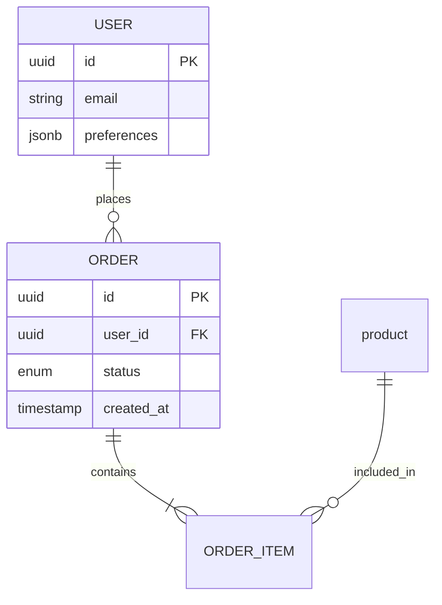

# Database Schema Designer

Expert guidance on structuring data for scalability, integrity, and performance.

## When to Use This Skill
- Designing a new database from scratch.
- Adding complex domains (e.g., "Add Social Features" or "Add Inventory Management").
- Deciding between SQL (Relational) vs NoSQL (Document/Graph).
- Troubleshooting architectural bottlenecks (Deadlocks, Hot partitions).
- Documenting data models with Entity-Relationship Diagrams (ERD).

## Core Concepts

### 1. Relational Modeling (SQL)
**Normalization (The Rules)**
*   **1NF**: Atomic values. (No comma-separated lists).
*   **2NF**: No partial dependencies. (All non-keys depend on the *whole* primary key).
*   **3NF**: No transitive dependencies. (Non-keys depend ONLY on the primary key, not other non-keys).

**Denormalization (The Exception)**
*   Break rules *intentionally* for read performance (e.g., storing `user_name` on the `comments` table to avoid joins).
*   **Trade-off**: Faster reads, complex updates (consistency).

### 2. NoSQL Modeling
**Document (MongoDB)**
*   **Embedding**: "One-to-Few". (Embed addresses inside User).
*   **Referencing**: "One-to-Many". (Reference OrderIDs inside User).
*   **Pattern**: "Computed Pattern" (Read-heavy? Pre-calculate totals on write).

**Key-Value (Redis/DynamoDB)**
*   **Access Patterns First**: You must know how you will query data *before* designing the schema.
*   **Single Table Design**: Overloading keys (`PK=User#123`, `SK=Order#456`) to fetch related data in one request.

### 3. Scalability Patterns
*   **Sharding (Horizontal Scaling)**: Splitting data across multiple servers based on a "Shard Key" (e.g., UserID).
*   **Partitioning (PostgreSQL)**: Splitting huge tables by active range (e.g., `orders_2024`, `orders_2025`).

## Workflow

1.  **Identify Entities**: User, Product, Order.
2.  **Define Relationships**:
    *   One-to-One (User <-> Profile).
    *   One-to-Many (User <-> Orders).
    *   Many-to-Many (Students <-> Classes).
3.  **Choose Engine**:
    *   Structured, Strict Consistency? -> **PostgreSQL**.
    *   Unstructured, High Write Throughput? -> **MongoDB/Cassandra**.
4.  **Draw ERD**: Use Mermaid or textual description.

## Example: E-Commerce Schema

## Resources
- [PostgreSQL Database Design](https://www.postgresql.org/docs/current/ddl.html)
- [MongoDB Schema Design Patterns](https://www.mongodb.com/basics/schema-design-patterns)
- [DynamoDB Design Guide](https://docs.aws.amazon.com/amazondynamodb/latest/developerguide/bp-modeling-nosql.html)
